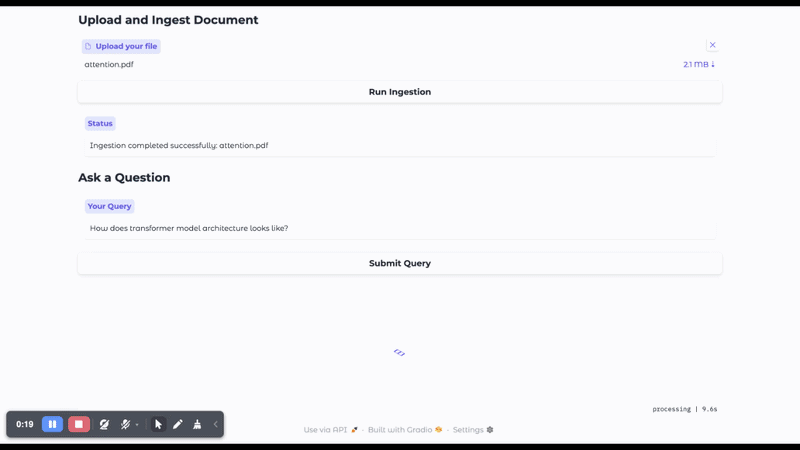

# RAG-Based-Document-Question-Answering-System

## Problem Statement
To develop a RAG based document question answering system that can answer user questions using information from documents and returns relevant answers based on the query.

## Demo
Click on the thumbnail below to watch the full demo video.
[](https://www.awesomescreenshot.com/video/51645922?key=60c08279765b44e007719f2917be9097)

# Prerequisite

First get the Gemini API Key from [Here](https://aistudio.google.com/app/apikey)

## Steps to Setup and Run the Application

## First create a virtual environment using the following command
```python
python -m venv doc_qa_env
```

## Activate the virtual environment and install the dependencies as follows
```python
source doc_qa_env/bin/activate
pip install -r requirements.txt
```

## Export the API KEY in the environment using the following command
```base
export GOOGLE_API_KEY="<your-api-key>"
```

## Launch the application using the following command
```python
python app.py
```

## Next Steps for Futher Improvement
1. Quantitative evaluation of different queries using the RAGAS framework
2. Controlling hallucinations by adding guardrails through post-generation validation, where guardrails are applied to the final output
3. Reducing the latency of the RAG system